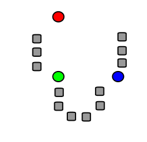
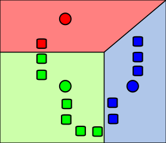
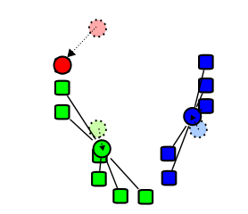
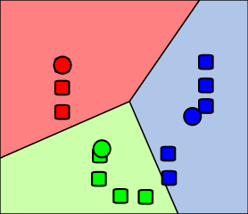

```{r setup, include = FALSE}
knitr::opts_chunk$set(
  echo = FALSE,
  warning = FALSE,
  message = FALSE
)
```

```{r libraries, include = FALSE}
library(dplyr)
library(ggplot2)
```


# Description

Given a set of observations $(x_1, x_2, \cdots, x_n)$, where each observation is a *d*-dimensional real vector, k-means clustering aims to partition the *n* observations into $k(\leq n)$ sets $S = \{S_1, S_2, \cdots, S_k\}$ so as to minimize the within-cluster sum of squares (WCSS) (i.e. variance). Formally, the objective is to find:

$$
\underset{S}{\arg \min} \sum_{i=1}^{k} \sum_{x \in S_i} ||x - \mu_i||^2 = \underset{S}{\arg \min} \sum_{i=1}^{k} |S_i| Var S_i
$$


# History

The term "k-means" was first used by James MacQueen in 1967[@Mac:1967], though the idea goes back to Hugo Steinhaus in 1957[@Ste:1956]. The standard algorithm was first proposed by Stuart Lloyd in 1957 as a technique for pulse-code modulation, though it wasn't published outside of Bell Labs until 1982[@Llo:1982]. In 1965, E. W. Forgy published essentially the same method, which is why it is sometimes referred to as Lloyd-Forgy[@For:1965].


# Algorithms





